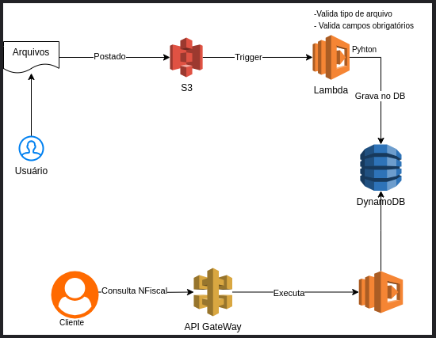

Processamento de usos da aws local 
Stack processada localmente

## S3
O **Amazon S3** é um serviço de armazenamento em nuvem da AWS que permite "armazenar e acessar" dados de forma segura e escalável. Ele suporta qualuqer tipo de arquivo (vídeo, áudio, imagens, documentos,etv.) e é

#### Principais vantagens do S3:
- Durabilidade: Altamente confiável, com redundância para proteger falhas. 
- Disponibilidade: Garante acesso contínuo aos dados
- Escalabilidade: Ajusta Automaticamente a capacidade de armazenamento conforme a necessidade
- Segurança: Oferece criptografia, controle de acesso e monitoramento de atividades
Gerar URLs assináveis nos S3, que terá funcionamento por apenas o tempo que for configurado.

## AWS Lambda
O **AWS Lambda** é um serviço de computação serveless que permite executar códigos em resposta a eventos, sem a necessidade de gerenciar servidores. Basta fazer o upload do código e o Lambda se encarrega de executar automaticamente, escalando conforme a demanda.
Ideal que tenha execução de no máximo 15 minutos.
#### Principais vantagens do Lambda:
- Execução sob demanda: O código é executado apenas quando necessário, respondendo a eventos
	- Sempre cumprindo a boa prática de pequenas execuções 
- Escalabilidade automática: Ajusta a capacidade automaticamente com base no número de eventos.
- Custo eficiente: Cobra apenas pelo tempo dee execução e pela quantidade de solicitações;
- Integração co moutros serviços AWS: Funciona como um conector entre diferentes serviços da AWS, com S3, DynamoDB, API Gateway

## HandsOn:
Projeto: Upload de Arquivos com Processamento e Registro do DynamoDB
### Fluxo do Projeto
1. O Usuário faz o upload de um arquivo (ex: CSV ou JSON) em um bucket S3. 
2. Um evento no S3 dispara uma Lambda Function escrito em Python. 
3. A Lambda proessa o conteúdo do arquivo (ex: extrai informações) e gravar esses dados em uma tabela no DynamoDB. 
4. Outra função Lambda irá consultar a tabela e expor os dados por meio de uma API Gateway.
   
### AWS Local com LocalStack: 
O princiapl objetivo da Localstack é fornecer uma alternativa local para o desenvolvimento, teste e integração de serviços em nuvem, sem a necessidade de acessar a AWS real. 
Isso permite aos desenvolvedores economizar tempo e custos, especialmente em testes automatizados e em ambientes de integração contínua (CI/CD).
Serviços suportados: Lambda, API Gateway, S3, DynamoDB, SNS, SQS, CloudFormation, entre outros.

---

# 🚀 Implementando o Ciclo de Processamento de Notas Fiscais com LocalStack


## 1. Visão Geral da Arquitetura

O ciclo é dividido em duas partes principais:

1. **Processamento Assíncrono (Upload):** Um usuário faz o upload de um arquivo `.json` no S3, que dispara uma função Lambda para validar e gravar os dados no DynamoDB.
    
2. **Consulta Síncrona (API):** Um cliente externo consulta os dados no DynamoDB através de um endpoint do API Gateway, que executa uma segunda função Lambda para buscar os registros.
    
## 2. Configuração do DynamoDB

A primeira etapa é criar a tabela que armazenará as notas fiscais.

### Comando para Criar a Tabela

Crie a tabela `NotasFiscais` com o campo `id` como chave primária.

Bash

```
aws dynamodb create-table \
  --table-name NotasFiscais \
  --attribute-definitions AttributeName=id,AttributeType=S \
  --key-schema AttributeName=id,KeyType=HASH \
  --provisioned-throughput ReadCapacityUnits=5,WriteCapacityUnits=5 \
  --endpoint-url=http://localhost:4566 \
  --region us-east-1
```

## 3. Configuração do Processamento Assíncrono (S3 → Lambda → DynamoDB)

Este fluxo é ativado pelo upload de arquivos.

### 3.1. Código da Função Lambda (ProcessarNotasFiscais)

Esta função será disparada pelo S3. Ela irá ler o arquivo `.json` e salvar os dados no DynamoDB (usaremos um código simples de _placeholder_ para o trigger S3).

**Arquivo: `s3_handler.py`**

Python

```
import json
import boto3
from decimal import Decimal

# Configurações para LocalStack
dynamodb = boto3.resource('dynamodb', endpoint_url=os.getenv('DYNAMODB_ENDPOINT', 'http://localhost:4566'))
table = dynamodb.Table('NotasFiscais')

def lambda_handler(event, context):
    s3_event = event['Records'][0]['s3']
    bucket_name = s3_event['bucket']['name']
    file_key = s3_event['object']['key']
    
    print(f"Novo arquivo JSON recebido: {file_key} no bucket {bucket_name}")

    s3_client = boto3.client('s3', endpoint_url='http://localhost:4566')
    
    try:
        # 1. Baixar e ler o arquivo
        response = s3_client.get_object(Bucket=bucket_name, Key=file_key)
        file_content = response['Body'].read().decode('utf-8')
        notas_fiscais = json.loads(file_content)

        # 2. Processar e Gravar no DynamoDB
        for nf in notas_fiscais:
            # Validações (conforme diagrama)
            if not all(k in nf for k in ["id", "cliente", "valor", "data_emissao"]):
                print(f"Erro de validação: Campos obrigatórios faltando na NF {nf.get('id')}")
                continue # Pula para a próxima
                
            # Conversão para Decimal (necessário para o DynamoDB)
            nf['valor'] = Decimal(str(nf['valor']))
            
            # Grava no DB
            table.put_item(Item=nf)
            print(f"NF {nf['id']} salva com sucesso.")

        return {'statusCode': 200, 'body': 'Processamento de notas fiscais concluído.'}

    except Exception as e:
        print(f"Erro no processamento S3: {e}")
        return {'statusCode': 500, 'body': f'Erro: {str(e)}'}
```

### 3.2. Criação da Função Lambda (Deployment)

1. Crie o arquivo zip:
    
    Bash
    
    ```
    zip function_s3.zip s3_handler.py
    ```
    
2. Crie a função no LocalStack (usando o role genérico):
    
    Bash
    
    ```
    aws lambda create-function \
      --function-name ProcessarNotasFiscais \
      --runtime python3.9 \
      --role arn:aws:iam::000000000000:role/lambda-s3-role \
      --handler s3_handler.lambda_handler \
      --zip-file fileb://function_s3.zip \
      --endpoint-url=http://localhost:4566 \
      --region us-east-1
    ```
    

### 3.3. Configuração do Bucket S3 e Trigger

1. **Crie o Bucket:**
    
    Bash
    
    ```
    aws s3 mb s3://notas-fiscais-upload \
      --endpoint-url=http://localhost:4566 \
      --region us-east-1
    ```
    
2. **Adicione a Permissão S3 para Invocar a Lambda:** (O comando que estava falhando antes!)
    
    Bash
    
    ```
    aws lambda add-permission \
      --function-name ProcessarNotasFiscais \
      --statement-id s3-trigger-permission \
      --action "lambda:InvokeFunction" \
      --principal s3.amazonaws.com \
      --source-arn "arn:aws:s3:::notas-fiscais-upload" \
      --endpoint-url=http://localhost:4566 \
      --region us-east-1
    ```
    
3. **Crie o arquivo `notification.json`:** (Conforme o último pedido)
    
    JSON
    
    ```
    {
      "LambdaFunctionConfigurations": [
        {
          "Id": "TriggerProcessarNotasFiscais",
          "LambdaFunctionArn": "arn:aws:lambda:us-east-1:000000000000:function:ProcessarNotasFiscais",
          "Events": ["s3:ObjectCreated:*"],
          "Filter": {
            "Key": {
              "FilterRules": [
                {
                  "Name": "suffix",
                  "Value": ".json"
                }
              ]
            }
          }
        }
      ]
    }
    ```
    
4. **Configure o Trigger S3:**
    
    Bash
    
    ```
    aws s3api put-bucket-notification-configuration \
      --bucket notas-fiscais-upload \
      --notification-configuration file://notification.json \
      --endpoint-url=http://localhost:4566 \
      --region us-east-1
    ```
    

## 4. Configuração da Consulta Síncrona (API Gateway → Lambda → DynamoDB)

### 4.1. Código da Função Lambda (API Handler)

Esta é a função que você forneceu as imagens, responsável por lidar com `GET` (consulta) e `POST` (inserção manual via API).

**Arquivo: `grava_db.py`**

_(Use o código completo que gerei na resposta anterior: o manipulador principal é `lambda_handler`.)_

### 4.2. Criação da Função Lambda (Deployment)

1. Crie o arquivo zip:
    
    Bash
    
    ```
    zip function_api.zip grava_db.py
    ```
    
2. Crie a função no LocalStack:
    
    Bash
    
    ```
    aws lambda create-function \
      --function-name ConsultaNotasFiscaisAPI \
      --runtime python3.9 \
      --role arn:aws:iam::000000000000:role/lambda-api-role \
      --handler grava_db.lambda_handler \
      --zip-file fileb://function_api.zip \
      --endpoint-url=http://localhost:4566 \
      --region us-east-1
    ```
    

### 4.3. Configuração do API Gateway

Devido à complexidade de comandos do API Gateway, a maneira mais fácil de configurar o roteamento (API Gateway -> Lambda) no LocalStack é via **Terraform** ou o **`awslocal`** com a **CLI do LocalStack**.

**Configuração Simplificada via CLI:**

1. **Crie a API REST:**
    
    Bash
    
    ```
    aws apigateway create-rest-api \
      --name "NotasFiscaisAPI" \
      --endpoint-url=http://localhost:4566 \
      --region us-east-1
    # Guarde o 'id' retornado (Ex: 'api_id')
    ```
    
2. **Crie o Recurso (Ex: /notas):**
    
    Bash
    
    ```
    # Use o 'rootResourceId' da API criada
    aws apigateway create-resource \
      --rest-api-id <api_id> \
      --parent-id <rootResourceId> \
      --path-part notas \
      --endpoint-url=http://localhost:4566 \
      --region us-east-1
    # Guarde o 'id' retornado (Ex: 'resource_id')
    ```
    
3. **Configure os Métodos (GET e POST) e a Integração com a Lambda:** (Passos avançados omitidos por brevidade, pois exigem muitas chamadas CLI para setar o `Integration` e o `Deployment`).
    
    _Para um ambiente LocalStack, você precisará configurar a integração Lambda Proxy e implantar a API para que ela funcione corretamente._
    

## 5. Ciclo de Teste Final

1. **Upload do Arquivo (Testando o Trigger S3):**
    
    - Crie um arquivo `nf-teste.json` com o formato do primeiro JSON que você forneceu.
        
    - Faça o upload:
        
        Bash
        
        ```
        aws s3 cp nf-teste.json s3://notas-fiscais-upload/nf-teste.json \
          --endpoint-url=http://localhost:4566 \
          --region us-east-1
        ```
        
    - Verifique os logs do LocalStack para confirmar que a Lambda `ProcessarNotasFiscais` foi invocada e gravou no DynamoDB.
        
2. **Consulta (Testando a API Gateway):**
    
    - Use uma ferramenta como `curl` ou Postman no endpoint do API Gateway (após configurá-lo) para fazer uma requisição `GET` ao recurso `/notas` e verificar os dados salvos.
